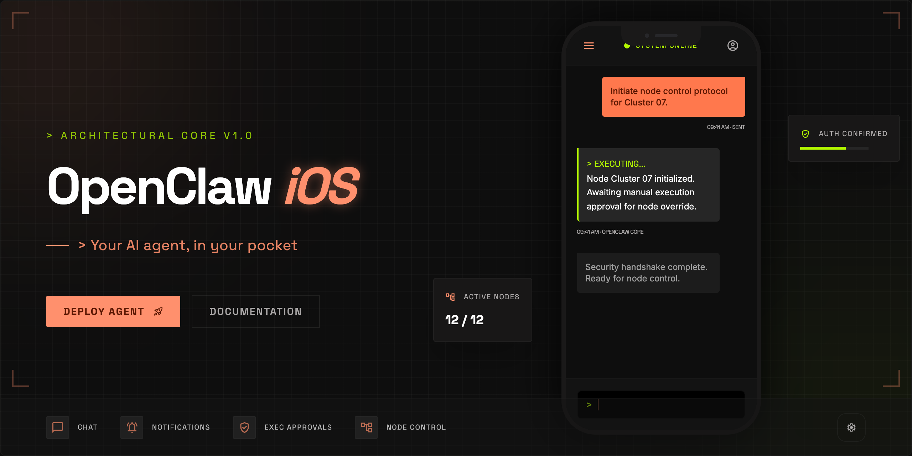
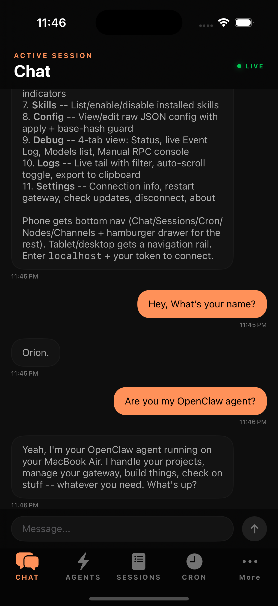
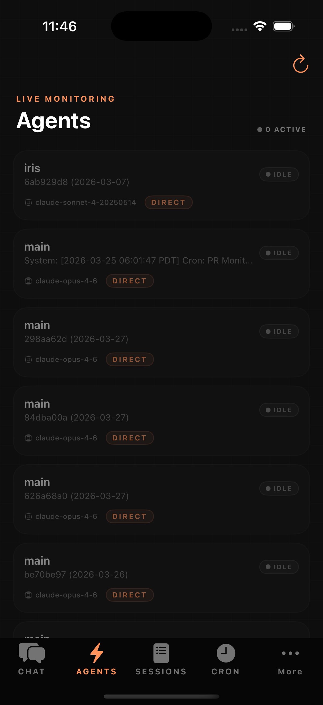

<p align="center">
  
</p>

# OpenClaw iOS

Native iOS client for IronClaw-backed agents — talk to your AI agent from anywhere.

## Screenshots

<p align="center">
  
  &nbsp;&nbsp;
  
</p>

## Features

- **Chat** - Full conversational UI with streaming responses, markdown rendering, and code blocks
- **Live Agents** - Real-time monitoring of active agent sessions with status indicators
- **Sessions** - Browse and manage active agent sessions
- **Cron Jobs** - View, toggle, and trigger scheduled jobs
- **Nodes** - See paired devices and their capabilities
- **Settings** - Connection management, server info, quick links

## Architecture

```
iPhone App (operator role)
    |
    v  HTTP / SSE / compatibility read APIs
IronClaw service (your Mac, VPS, Pi)
    |
    v
Your AI agent
```

The app connects to an IronClaw-backed service using the current operator-facing protocol layer. Unsupported legacy actions should be hidden or treated as read-only rather than presented as writable mobile actions.

## Requirements

- iOS 17.0+
- Xcode 16+
- An IronClaw-backed service running somewhere reachable from your phone

## Setup

1. Open `OpenClaw.xcodeproj` in Xcode
2. Set your development team in Signing & Capabilities
3. Build and run on your device or simulator
4. Enter your IronClaw base URL and Bearer token
5. Start chatting

## Connection Model

- Primary transport: `POST /v1/responses` over HTTP/SSE
- Model discovery: `GET /v1/models`
- Authentication: `Authorization: Bearer <token>`
- Some operator surfaces still use compatibility read APIs where no dedicated IronClaw mobile write path exists yet

## Project Structure

```
OpenClaw/
  App/              - App entry point, root navigation, state
  Core/
    Auth/           - Connection config and keychain storage
    Networking/     - GatewayClient (WebSocket), ChatService
    Protocol/       - Gateway protocol types, AnyCodable
    Storage/        - Keychain helper
  Features/
    Agents/         - Live agent monitoring
    Chat/           - Chat UI, connect screen
    Cron/           - Cron job management
    Nodes/          - Paired device browser
    Sessions/       - Session list and details
    Settings/       - Connection info, links
  Shared/
    Components/     - Reusable UI (status dot, markdown renderer)
    Extensions/     - Haptics, utilities
    Models/         - Domain models
  Resources/        - Assets, Info.plist
```

## Network Requirements

The IronClaw service must be reachable from your phone:
- **Local**: Same Wi-Fi network
- **Tailscale**: Via tailnet hostname
- **Remote**: Public HTTPS endpoint

Enable `NSAllowsLocalNetworking` in Info.plist for local connections (already configured).

## Built With

- SwiftUI + Swift 6
- URLSessionWebSocketTask (no dependencies)
- XcodeGen for project generation
